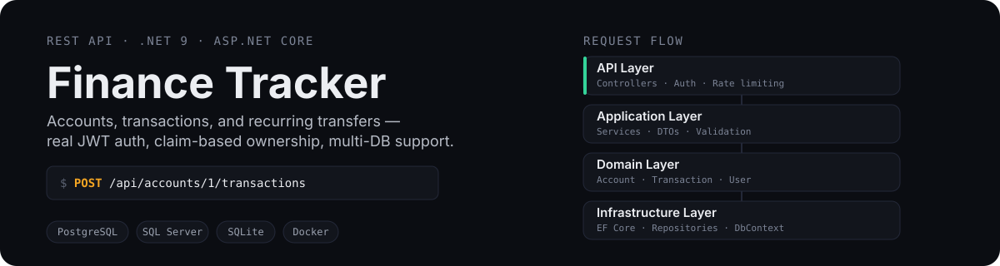
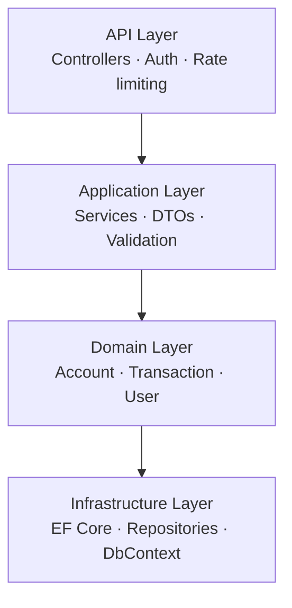

<p align="center">
  
</p>

<p align="center">
  
  
  
  
  
</p>

A personal finance tracking REST API — register, create accounts, log transactions, and automate recurring transfers. Runs on SQLite in dev, PostgreSQL or SQL Server in production, with real JWT auth and per-user data isolation.

## Try it in 30 seconds

```bash
# 1. register
curl -X POST http://localhost:5029/api/auth/register \
  -H "Content-Type: application/json" \
  -d '{"email":"you@example.com","password":"Password123"}'

# 2. log in and grab the token
curl -X POST http://localhost:5029/api/auth/login \
  -H "Content-Type: application/json" \
  -d '{"email":"you@example.com","password":"Password123"}'

# 3. create an account and log a transaction
curl -X POST http://localhost:5029/api/accounts \
  -H "Authorization: Bearer <token>" -H "Content-Type: application/json" \
  -d '{"name":"Checking"}'

curl -X POST http://localhost:5029/api/accounts/1/transactions \
  -H "Authorization: Bearer <token>" -H "Content-Type: application/json" \
  -d '{"amount":-42.50,"description":"Groceries","category":"Food"}'
```

Or skip curl entirely — Swagger UI at `/swagger` walks through the same flow with an Authorize button.

## Features

- Register and log in with JWT auth, BCrypt-hashed passwords
- Accounts and transactions scoped per user — claim-based ownership, not just a filter
- Transfers between accounts, plus recurring transfer schedules
- Paginated list endpoints for accounts and transactions
- Rate-limited login/register, HSTS + HTTPS redirection outside dev
- Health check at `/health`, structured request logging

## Architecture



`FinanceTracker.Api` hosts the API layer. `FinanceTracker` hosts Application, Domain, and Infrastructure.

## Running locally

```bash
# from repo root
dotnet run --project FinanceTracker.Api

# or enter the project first
cd FinanceTracker.Api
dotnet run
```

API runs at `http://localhost:5029`. Migrations apply automatically on startup.

Requires a JWT secret via user secrets:

```bash
dotnet user-secrets set "JwtSettings:SecretKey" "your-secret-key-min-32-chars"
```

## Running tests

```bash
dotnet test
```

## Running with Docker

```bash
docker-compose up --build
```

API runs at `http://localhost:5029`. SQLite is persisted in `./data/` for local use; PostgreSQL is used in production.

## Environment variables

| Variable | Description | Example |
|----------|-------------|---------|
| `ConnectionStrings__DefaultConnection` | SQLite connection string (fallback) | `Data Source=/app/data/finance.db` |
| `ConnectionStrings__PostgreSQL` | PostgreSQL connection string | `Host=...;Database=...;Username=...` |
| `ConnectionStrings__SqlServer` | SQL Server connection string | `Server=...;Database=...;User ID=...` |
| `JwtSettings__SecretKey` | JWT signing secret (min 32 chars) | `your-secret-key-32-chars-minimum` |
| `JwtSettings__Issuer` | JWT issuer | `FinanceTracker` |
| `JwtSettings__Audience` | JWT audience | `FinanceTrackerUsers` |
| `Cors__AllowedOrigins` | Comma-separated allowed origins | `http://localhost:3000` |
